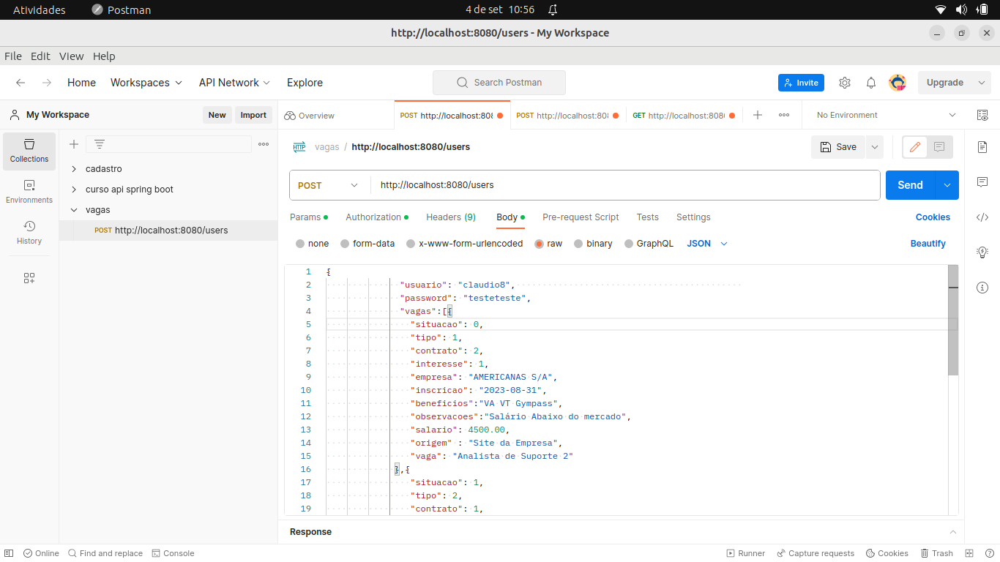
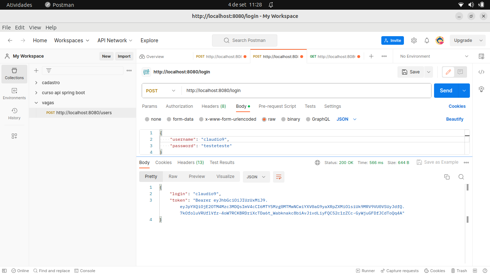
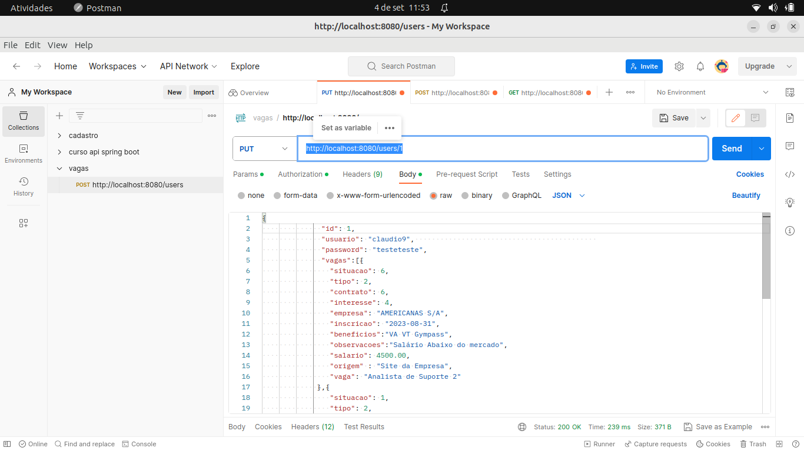

### Api- Vagas Demo ###

Essa api faz o cadastro de vagas que um determinado usuario pode ter interesse ou não
de acordo com caracteristicas como 

- Tipo
- Contrato
- Interesse
- Situacao 

Para testar a api faça do Download do repositorio fonte, ou clone usando git

```
$ git clone https://github.com/claudioneves1981/vagas-emprego.git
```

acesse a pasta principal

depois execute

```
$ ./gradlew bootRun
``` 

a aplicação vai rodar na porta 8080

Abra o postman 

para cadastrar um usuario 

acesse 

```
http://localhost:8080/users
```


nas opcoes de situação tipo, contrato e interesse é utilizado 
enumeração

para o caso vc deseja cadastrar uma opção especifica vc usara um numero correspondente.

<table>
<thead>
    <th>Opcao</th>
    <th>Tipo</th>
    <th>Contrato</th>
    <th>Situacao</th>
    <th>Interesse</th>
</thead>
<tbody>
<tr>
    <td>0</td>
    <td>REMOTO</td>
    <td>PJ</td>
    <td>OFERTA</td>
    <td>BAIXISSIMO</td>
</tr>
<tr>
    <td>1</td>
    <td>HIBRIDO</td>
    <td>CLT</td>
    <td>DESISTI</td>
    <td>BAIXO</td>
</tr>
<tr>
    <td>2</td>
    <td>PRESENCIAL</td>
    <td>FREELANCE</td>
    <td>AGUARDANDO</td>
    <td>MEDIO</td>
</tr>
<tr>
    <td>3</td>
    <td></td>
    <td>TEMPORARIO</td>
    <td>CONGELADA</td>
    <td>ALTO</td>
</tr>
<tr>
    <td>4</td>
    <td></td>
    <td>ESTÁGIO</td>
    <td>ANDAMENTO</td>
    <td>ALTISSIMO</td>
</tr>
<tr>
    <td>5</td>
    <td></td>
    <td>TRAINEE</td>
    <td>ELIMINADO</td>
    <td></td>
</tr>
<tr>
    <td>6</td>
    <td></td>
    <td>OUTROS</td>
    <td>INSCRITO</td>
    <td></td>
</tr>
</tbody>
</table>

para o login você usará o seguinte end point

```
http://localhost:8080/login
```




o mesmo irá retornar um jwt token que você usará para fazer o acesso e as consultas

### Consultas ###

vc pode fazer a consulta das vagas por usuario usando o endpoint

```
http://localhost:8080/users/{usuario}/vagas/
```


So lembrando que deve se colocar o token JWT em Authorization

#### Outras consultas ####

As outras consultas seguem a seguinte logica

- por Tipo
    ```
  http://localhost:8080/users/{usuario}/vagas/tipo/{opcões}
  ```
  Opções {remoto, hibrido,presencial}


- por Interesse
    ```
  http://localhost:8080/users/{usuario}/vagas/interesse/{opcoes}
  ```
  Opções {baixissimo, baixo, medio, alto, altissimo}


- por Situacao
  ```
  http://localhost:8080/users/{usuario}/vagas/situacao/{opcões}
  ```
  Opções {oferta,desisti,aguardando,congelada,andamento,eliminado,inscrito}


- por Contrato
    ```
  http://localhost:8080/users/{usuario}/vagas/contrato/{opcões}
  ```
  Opções {pj, clt, freelance, temporario, estagio, trainee, outros}


### Outras Opções ###

Atualizando Cadastro

é feito por esse endpoint

```
http://localhost:8080/users/{id}
```

  
